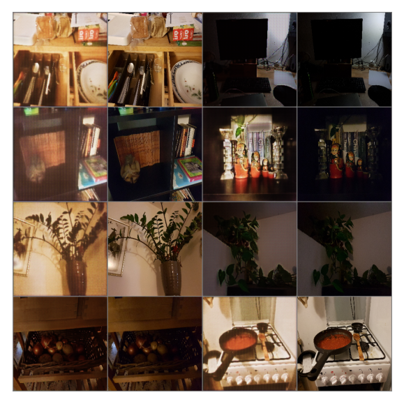

# HOWTO_GANS
GANs are an exciting and rapidly changing field, delivering on the promise of generative models in their ability to generate realistic examples across a range of problem domains

### A small guide that I made for myself after reading the book
- overview of basic models with examples (book_HOWTO_GANS)

### Converting a dark image to a light
- small pix_to_pix model(s7pixGan)

[Data link](https://www.kaggle.com/knn165897/s7-isp-dataset/data)
